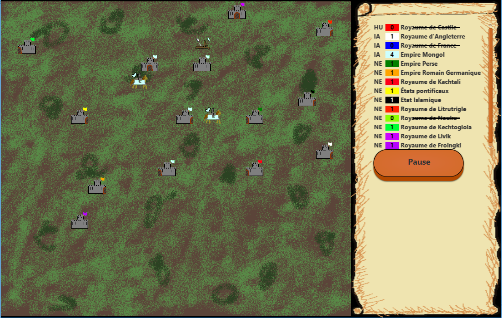
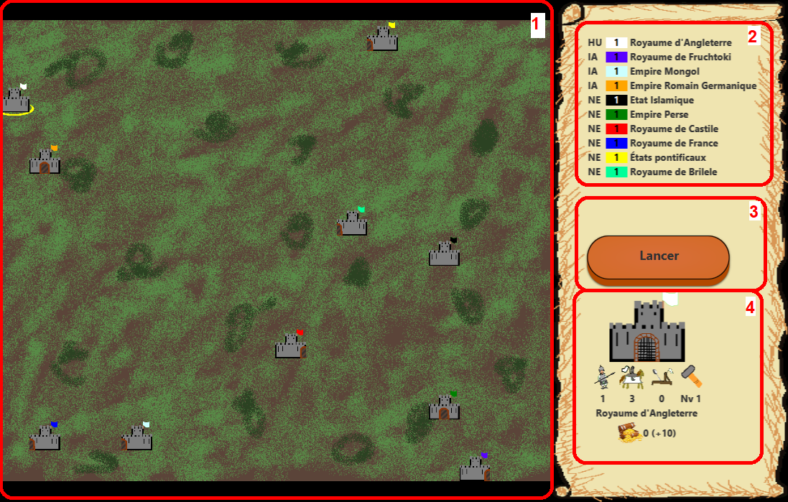
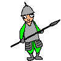
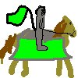

# PICROM-Wars, Jeu de stratégie
NB : Although the code is in English, this read-me and the game are in French.

Réalisé avec ***Picachoc*** : https://github.com/picachoc

Lien github du projet : https://github.com/ROMAINPC/PICROM-Wars.git

## Introduction :

Dans le cadre de notre troisième année de licence d'informatique à l'université de Bordeaux, nous avons réalisé un jeu de stratégie en Java dont l'affichage est basé sur la librairie JavaFX. Ce jeu constitue notre projet de Programmation Orientée Objet du semestre 5.

## Structure du projet et exécution :
### Lancement :
### IDE :
Ce projet a été édité sous l'IDE Eclipse, il est conseillé de l'exécuter avec Eclipse ou un IDE similaire.
### Installation (nécessite JDK) :
### Java 11+ (JavaFX SDK nécessaire -> <https://openjfx.io/>):
* Se placer à l'intérieur du dossier `src`
* `javac -d ../bin --module-path "path\to\javafx-sdk-X\lib" --add-modules javafx.controls picrom/*.java`
* `cd ..`
* Copier [src/picrom/application.css](src/picrom/application.css) dans [bin/picrom/application.css](bin/picrom/application.css)
* Copier [src/Drawables](src/Drawables) dans [bin/Drawables](bin/Drawables)

### Java 8, 9 ou 10 :
* Retirer `--module-path "path\to\javafx-sdk-X\lib" --add-modules javafx.controls` des commandes précédentes.

### Exécution (nécessite JRE) :
* `cd bin`
* `java picrom.Main`
* OR for java 11+ `java --module-path "path\to\javafx-sdk-X\lib" --add-modules javafx.controls picrom.Main`

### Paramètres :
Ce projet n'as pas encore été conçu pour être exporté en exécutable, il est possible de modifer certains éléments de gameplay depuis la classe [src/picrom/utils/Settings.java](src/picrom/utils/Settings.java)

### Versions disponibles :
Il existe 3 branches sur notre dépôt git : master, serialisation et testpathfinding.
Chacune correspond à une version du jeu contenant une fonctionnalité spécifique.

#### Version stable (branche master)
Version rendue

#### Version avec sauvegarde (branche serialisation)
Cette version offre la possibilité de sauvegarder et charger une partie.

Au démarrage du jeu, on peut choisir si l'on souhaite ou non garder une sauvegarde. Dans le premier cas, le joueur peut charger une sauvegarde au format PICROM-WARS (".pw"). Dans le deuxième cas, un monde est généré de la même manière que dans la branche master.
Lorsque le joueur appuie sur pause, un bouton "sauvegarder" apparaît sur le côté. S'il clique dessus, il peut entrer un nom de sauvegarde, puis celle-ci sera enregistrée dans le dossier "saves" à la racine du projet.

Cependant, il survient un problème lors de la désérialisation de la classe Owner, la couleur est considérée commme nulle dans certains cas, ce qui provoque une NullPointerException lors de la colorisation des entités. Nous n'avons pas encore trouvé la cause, et c'est pour cette raison que nous n'avons pas implémenté la sauvegarde dans la version stable.

#### Version avec autre pathfinding (branche pathfinding)

Nous avons créé cette branche pour améliorer le pathfinding des unités afin qu'elles aillent en ligne droite et évitent les châteaux. Cependant, les unités se bloquent parfois donc nous ne l'avons pas implémenté dans la version stable.

## Règles et fonctionnement du jeu :

### Objectif :  
Au lancement d'une partie, chaque royaume dispose d'un seul château. L'objectif est de conquérir les châteaux adverses jusqu'à ce qu'il ne reste plus d'ennemis.
### Contrôles et interface :

En 1 est visible l'écran du jeu.

En 2, la liste des joueurs (HU : Humain, IA : intelligence artificielle, NE : neutre / baron) ainsi que leur nom, leur couleur et le nombre de châteaux conquis. Si un royaume perd, son nombre de château tombe à 0 et il est barré de la liste.

En 3, le bouton de lancement et de pause. A noter que la pause du jeu est prise en compte uniquement à la fin d'un tour.

Lorsque le joueur clique sur un château, il est encerclé en jaune et des informations apparaissent en 4. Sont visibles :
- Le château en lui-même ainsi que l'état de sa porte.
- La garnison courante ainsi que le niveau du château.
- Le nom du royaume propriétaire de ce château.
- Le trésor du château et son revenu.

Si le château lui appartient, il peut choisir ce qu'il produit en cliquant sur l'une des quatre icônes correspondantes aux trois unités et à l'amélioration du niveau du château. On peut également fermer ou ouvrir la porte en cliquant sur celle-ci. Une fois son château sélectionné, on peut choisir le château cible en faisant un clic droit, ce qui a pour effet de l'encercler en rouge. 

### Châteaux :
Un château est défini par :
- Un propriétaire
- Un trésor
- Une garnison
- Une production en cours
- Un objectif
- Une porte avec une direction et un état (ouverte ou fermée)

Le trésor est augmenté à chaque tour en fonction du revenu du château. 

La capture d'un château ennemi s'effectue en envoyant des unités sur celui-ci. Lors d'une attaque, les unités inflige des dommages aux unités de la cour ennemie. Si une unité a infligé tous ses dommages, elle meurt. Le château est capturé lorsque la cour est vide et qu'une unité l'attaque.

Les châteaux alliés peuvent s'échanger des unités entre eux. Il suffit que le joueur définisse un des châteaux comme objectif pour envoyer des unités d'une cour à l'autre.

Si le joueur produit une unité dans une de ses cours, cette production sera conservée une fois l'unité produite. Cependant, la production est redéfinie à "nul" s'il vient de produire un niveau supplémentaire.

### Unités :

Voici les différentes unités et leurs caractéristiques :

|               |                 asset                 | coût de prod.| temps de prod. (en tours) | vitesse (case/tour)| points de vie | dommages |
| -------------:|   :-------------:                     | :-----:      | :-----:                   | :----:             | :----:        |  :----:  |
| **Piquier**   |  |    100       |       5                   |        2           |       1       |    1     |
| **Chevalier** |   |    500       |      20                   |        6           |       3       |    5     |
| **Onagre**    |   |    1000      |       50                  |        1           |       5       |    10    |

Les unités les plus lentes sortent de la cour en premier.

Lorsqu'une unité sort, son objectif est mis à jour et il ne peut plus changer. Elle ira ainsi jusqu'à son objectif, quoiqu'il arrive.

## Remarques de gameplay :
* Nous avons décidé de faire sortir les unités une par une des châteaux, cela ne change pas vraiment l'équilibrage du jeu mais rend plus joli le jeu sans unités empilées.
* Les versions actuelles des IA sont donc volontairement un mélange de stratégie et de role-play.

## Choix et remarques d'implémentation :
### Remarques sur le rôle des classes :

#### [Main](src/picrom/Main.java)
* S'occupe de toutes les intéractions utilisateurs et s'occupe de mettre en place l'interface
* S'occupe aussi de créer un World qui correspond au plateau de jeu, on peut tout à fait imaginer une application capable de faire tourner plusieurs parties en même temps.
* Nous avons également choisi de "faire tourner" la boucle de jeu depuis Main, voir ci dessous.

#### [World](src/picrom/gameboard/World.java)
* Un World est un plateau de jeu, mais pas une partie de jeu en elle même.
* World offre donc des méthodes pour calculer les actions lors d'une itération d'un tour de jeu. Ainsi c'est aux classes exécutant le plateau de faire tourner les tours. Ce qui leur laisse le choix de la vitesse d'exécution ou des actions de calcul.( On peut imaginer déplacer 2 fois les unités chaque tour par exemple).
* Dans un monde il y a des bâtiments (Castle) et des personnages (Unit), choix a été fait de stocker d'une part les personnages, et d'autres part les joueurs (Owner). Conceptuellement ce sont les joueurs qui jouent pas leurs propriétés foncières.
* Un tableau 2D stockant les référence des châteaux est tout de même utilisé pour simplifier la détection des collisions.
* L'utilisation du Layout personnalisé [Context](src/picrom/gameboard/Context.java) permet au monde de s'adapter à la fenêtre tout en gardant des proportions cohérentes.

### [Owner](src/picrom/owner/Owner.java)
* Même argument que ci dessus, l'essence de ce jeu sont les joueurs, chaque référence de cette classe désigne un joueur (voir aussi les classes dérivées), les joueurs doivent donc connaître la liste de leurs châteaux.

### [Entity](src/picrom/entity/Entity.java)
* Tout élément dans un monde est une entité, personnages comme châteaux.
* Cette classe est essentiellement graphique, on notera l'utilisation de "Property" pour les coordonnées et l'affichage des entités dans le plateau de jeu. Ce qui permet de cacher un peu la synchronisation graphique de ces valeurs.

### [Unit](src/picrom/entity/unit/Unit.java)
* Même si les unités sont des entités, Owner n'a pas de liste directe des ses unités. En effet les règles actuelles empêchent de dérouter les unités en cours de déplacement. Elles sont donc uniquement stockées par les châteaux comme garnison et par un World comme unités actuellement en plein trajet.

### [Castle](src/picrom/entity/castle/Castle.java)
* Les châteaux réalisent beaucoup d'actions (objectif, production, garnison) la classe est donc assez conséquente.
* Comme il est possible d'améliorer un château, Castle implémente l'interface [Producible](src/picrom/entity/castle/Producible.java) de manière à considérer le passage d'un niveau comme une production réalisable par les unités de production.
* Les châteaux offrent des méthodes qui permettent de placer une couche d'abstraction avec les classes ci dessous.

### [ProductionUnit](src/picrom/entity/castle/ProductionUnit.java), [Door](src/picrom/entity/castle/Door.java) et [Courtyard](src/picrom/entity/castle/Courtyard.java)
* Dans le jeu actuel où les châteaux ne peuvent produire que une chose à la fois, n'ont qu'une porte et qu'une garnison. Ces classes pourraient ne pas exister.
* Plusieurs unités de production pourrait permettre de produire plusieurs chose en même temps ou de paralléliser une production pour l'accélérer par exemple.
* La classe Cour du château stocke actuellement toutes les unités, mais on pourrait imaginer avoir plusieurs casernes par type d'unités ou encore une garnison sur chaque versant du château.
* On pourrait également posséder plusieurs portes, attention cependant l'instance de Door des châteaux est actuellement directement accessible avec `getDoor()` dans Castle.

### Remarques sur le code :

#### JavaFX :

* De part la taille du projet, aucun Thread n'as été mis en place pour séparer les calculs du Thread JavaFX
* De même certains objets ont donc un double rôle : objet de gameplay ET composant JavaFX.
 Une séparation aurait pu être utilisée, par exemple avec 2 classes Entity et EntityView.
* La classe [Drawables](src/picrom/utils/Drawables.java) doit obligatoirement être instanciée une unique fois. Ce qui est un peu contraignant.

#### Collections d'objet:

* A de nombreux endroits nous utilisons des ArrayList ou LinkedList selon que nous estimions avoir à faire plus d'insertions ou de recherche d'éléments.
* En pratique toutes ces List sont parcourues avec des for each. Nous aurions dû utiliser des Set, la complexité n'aurait pas changé mais c'est conceptuellement plus clair. (En effet l'ordre des éléments n'est jamais vérifié et ils n'apparaissent jamais en double)

#### Sérialisation:

* Certaines classes n'étant pas sérialisables (en particulier celles issues de la librairie JavaFX), nous avons ajouté des attributs de types primitifs qui sont mis à jour durant le processus de sérialisation et les classes JavaFX sont réinstanciées durant la désérialisation. Nous avons donc redéfini les méthodes writeObject() et readObject().

* Nous avons défini des méthodes setUI() pour les classes nécessitant un affichage (World, Entity). Ces méthodes récupèrent les images, les chargent et les bind au contexte afin de les afficher. Elles sont appelées à la désérialisation.

#### Détails:
* Originellement les portes devaient déverser 3 unités par tour, c'est pourquoi une liste d'unités est encore utilisée à travers les méthodes telle que `getReadyUnits()` ou `getLaunchList()`

## Améliorations
* Fixer l'erreur provoquée par le chargement de la sauvegarde (couleur Nulle).
* Les valeurs de l'énoncé pour les points de vie et les dégâts mériteraient d'être rééquilibrées, les piquiers ont clairement un avantage défensif, et seuls les chevaux ont un petit avantage offensif.
* L'amélioration des châteaux devrait avoir un intérêt plus grand ou être plus rapide.

